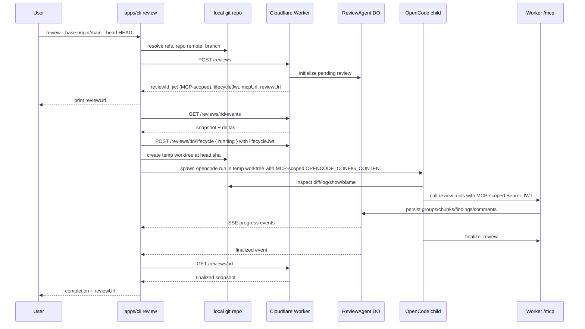

# feat: Add Bun CLI and OpenCode Integration

## Overview

Build M3: a `review` CLI in `apps/cli` that runs from a git repository, creates a Worker-backed review, launches OpenCode with a one-shot remote MCP configuration, streams review progress from SSE, and exits only when the Worker snapshot reaches a terminal state.

The CLI will use Bun as its runtime, Vitest for tests, and a deterministic mock-OpenCode harness for primary end-to-end coverage. The e2e harness will start `wrangler dev`, create temp git repos, run the real CLI, and use the mock executable to exercise the Worker MCP tools. A real OpenCode smoke test remains optional and opt-in because it depends on local OpenCode/provider auth.

### Execution Update: 2026-04-25

The local CLI slice is implemented and covered by deterministic e2e tests. The current branch contains `apps/cli`, Worker lifecycle tokens/routes, Hono-based Worker routing, OpenCode config generation, git/worktree isolation, SSE progress, process timeout/failure handling, and a mock OpenCode harness that starts `wrangler dev` and calls the Worker MCP endpoint.

The Worker-hosted remote MCP server/tool surface is now hardened as the production write path that OpenCode calls during review. OpenCode remains the local reviewer process. The remote MCP server is hosted by the existing Agents SDK `ReviewAgent` Durable Object and exposes `define_group`, `add_chunk`, `add_finding`, `add_inline_comment`, `set_narrative`, and `finalize_review`.

The MCP payload is also the future web UI contract. OpenCode must send enough structured diff data through `add_chunk` for the Worker snapshot to render a review without checking out the repository: file paths on both sides, base/head ranges, and ordered diff hunks with line kind, line numbers, and raw line content. The next milestone can build a React SPA that loads `/reviews/:id` from the review URL returned by `POST /reviews` and echoed by `finalize_review`; that SPA work is intentionally out of scope here.

### Done In This Pass

- U1-U7: CLI orchestration, lifecycle tokens/routes, git metadata/worktree isolation, OpenCode config/prompt generation, SSE progress, failure persistence, redaction, and spawned-Worker e2e with mock OpenCode.
- U10: Worker remote MCP server hardening with MCP-audience auth, Durable Object scoped persistence, structured diff hunks, foreign-key checks, terminal-state guards, line-anchor validation, group child projections, secret-like diff-line redaction, concise MCP tool responses, and `finalize_review` returning the canonical review URL.
- Test coverage: schema tests for structured chunks, Worker MCP route/tool integration tests through `wrangler dev`, and CLI e2e assertions that persisted snapshots include real repo metadata, base/head SHAs, groups, chunks, findings, inline comments, hunk lines, and finalization metadata.

### Still Left

- U8: optional real OpenCode smoke coverage behind an explicit opt-in flag/env var.
- U9: README and `docs/checkpoint.md` refresh with CLI usage, deterministic e2e commands, and real-smoke instructions.
- Route-level lifecycle edge coverage beyond the current token separation and e2e failure-state coverage.
- Future React SPA in `apps/web` that renders `/r/:id` from the persisted Worker snapshot.
- Deferred product/runtime work: dirty-worktree review mode, standalone binary compilation, token refresh/longer TTL, and large-diff budgeting.

---

## Problem Frame

Milestone 1 proved the Cloudflare Worker, Durable Object, MCP tools, and SSE stream work end-to-end. The next gap is the local orchestrator: a developer should be able to run one command in a git repo and get a review URL while OpenCode performs the review locally and writes structured findings through the remote MCP server.

The checkpoint defines the intended CLI flow: compute base/head, `POST /reviews`, build `OPENCODE_CONFIG_CONTENT`, spawn `opencode run`, subscribe to SSE, and print progress. This plan adapts that flow to Bun and adds one small Worker lifecycle API so reviews do not remain stuck when OpenCode fails before calling `finalize_review`.

---

## Requirements Trace

- R1. Provide a workspace package at `apps/cli` with a Bun-powered `review` CLI and Vitest tests.
- R2. Resolve git review metadata from a local repository: default `base=origin/main`, default `head=HEAD`, override with `--base` and `--head`, send exact SHAs to `POST /reviews`, and run OpenCode from a temporary worktree checked out at the resolved `head.sha`.
- R3. Create reviews through the Worker HTTP contract and validate `CreateReviewResponse` through shared schemas.
- R4. Build `OPENCODE_CONFIG_CONTENT` inline with a primary `review` agent, restricted permissions, and a remote MCP server using `oauth: false` plus `Authorization: Bearer <jwt>`.
- R5. Spawn `opencode run --agent review --format json --dangerously-skip-permissions "<prompt>"` with the inline config in the child environment.
- R6. Subscribe to `/reviews/:id/events` concurrently with OpenCode and print live human-readable progress plus the review URL at start and completion.
- R7. Add a CLI-called lifecycle path so review status changes to `running` and failure states are persisted when OpenCode cannot finalize.
- R8. Treat the Worker snapshot as the authoritative completion source; OpenCode exit code alone is not success.
- R9. Thoroughly e2e test the integration with spawned `wrangler dev`, temp git repos, and a mock OpenCode executable that performs real MCP tool calls.
- R10. Keep prompt engineering minimal but sufficient for plumbing; deeper semantic-review quality iteration is deferred.
- R11. Keep review credentials and local secrets out of CLI output, persisted failure messages, test snapshots, and logs.
- R12. Treat the Worker `/mcp` endpoint as the production remote MCP server that OpenCode calls; do not replace the local OpenCode reviewer with a remote reviewer.
- R13. Host review state and MCP tool side effects in the Agents SDK `ReviewAgent` Durable Object, keyed by the authenticated review ID.
- R14. Implement the review MCP tools as the only successful review-content write path: `define_group`, `add_chunk`, `add_finding`, `add_inline_comment`, `set_narrative`, and `finalize_review`.
- R15. Ensure MCP tool calls never accept `reviewId` from tool input; the MCP-scoped JWT remains the authority for review identity.
- R16. Cover MCP tool behavior with integration/e2e tests that call the real Worker MCP endpoint, not just unit-level mocks.

---

## Scope Boundaries

- M3 does not build the Web SPA beyond relying on the existing `/r/:id` URL shape.
- M3 does not publish a standalone compiled binary; Bun must be available to run the CLI. A compiled binary can be added later if distribution becomes important.
- M3 reviews committed refs only. Staged and unstaged working-tree changes in the source checkout are not included; OpenCode runs from a temporary worktree at `head.sha` so its file reads match the reviewed commit.
- M3 does not implicitly fetch `origin/main`; it resolves local refs and fails with actionable guidance when refs are unavailable.
- M3 does not manage OpenCode provider authentication, model selection, or user credentials.
- M3 does not rely on a real LLM for default tests; real OpenCode smoke coverage is opt-in.
- M3 does not tune review quality beyond a clear prompt and valid tool guidance.
- M3 does not replace OpenCode with a hosted review agent. The hosted component is the remote MCP server/tool surface that OpenCode uses to persist review output.
- M3 does not make the Worker inspect git or generate findings itself. Git inspection and semantic judgment remain OpenCode responsibilities; the Worker validates, persists, and streams structured review artifacts.

### Deferred to Follow-Up Work

- Web review UI in `apps/web`: planned as M2 in the checkpoint but intentionally outside this CLI-focused phase.
- Optional real OpenCode smoke coverage: default tests use mock OpenCode for deterministic behavior; a real LLM/provider-auth smoke remains manual/opt-in.
- README and checkpoint documentation refresh: implementation details are now in code/tests, but contributor-facing usage docs still need updating.
- Lifecycle route edge tests: current coverage proves token audience separation and CLI failure persistence; direct route-level edge cases can be expanded.
- Dirty worktree review mode: requires new metadata and prompt semantics for reproducible line anchors.
- Standalone binary compilation via `bun build --compile`: useful for distribution, but not required for this local CLI milestone.
- Longer-lived review credentials or token refresh: revisit if real reviews approach the current one-hour JWT TTL.
- Large-diff budgeting: structured hunk payloads make the UI self-contained, but future work should cap, summarize, or paginate very large diff payloads.

---

## Context & Research

### Relevant Code and Patterns

- `docs/checkpoint.md` is the source of truth for M3 behavior and verified OpenCode facts.
- `packages/schema/src/index.ts` defines shared `CreateReviewBody`, `CreateReviewResponse`, `Review`, and `ReviewEvent` contracts. CLI code should import and validate these rather than duplicate shapes.
- `apps/worker/src/worker.ts` implements `POST /reviews`, `GET /reviews/:id`, `GET /reviews/:id/events`, and `POST /mcp` with JWT auth for MCP.
- `apps/worker/src/review-agent.ts` owns SQL-canonical review state, SSE fan-out, and status fields `pending | running | finalized | failed`.
- `apps/worker/src/mcp.ts` wires the MCP tools OpenCode must call: `define_group`, `add_chunk`, `add_finding`, `add_inline_comment`, `set_narrative`, and `finalize_review`.
- `apps/worker/scripts/smoke.ts` is the nearest existing e2e pattern: create review, subscribe to SSE, connect MCP, call tools, then fetch snapshot.
- `packages/schema/test/index.test.ts` and `packages/schema/vitest.config.ts` establish the repo's Vitest style.
- `tsconfig.base.json` enables strict TypeScript, `noUncheckedIndexedAccess`, and `exactOptionalPropertyTypes`; CLI code must avoid passing `undefined` optional fields.
- `biome.json` uses tabs, double quotes, semicolons, and line width 100.

### Institutional Learnings

- No `docs/solutions/` directory exists, so there are no prior institutional learnings for Bun CLI, OpenCode, MCP harnesses, or `wrangler dev` e2e tests.

### External References

- OpenCode CLI docs confirm `opencode run [message..]`, `--agent`, `--format json`, and `--dangerously-skip-permissions`.
- OpenCode config docs confirm `OPENCODE_CONFIG_CONTENT` as inline JSON at high precedence.
- OpenCode MCP docs confirm remote MCP config with `type: "remote"`, `url`, `headers`, and `oauth: false` to disable OAuth auto-detection.
- OpenCode permissions docs confirm explicit `deny` rules still matter while `--dangerously-skip-permissions` auto-approves permissions that are not explicitly denied.
- The current implementation uses `agents@0.0.99` for the `ReviewAgent` Durable Object host and state owner, while MCP request handling is wired through the MCP SDK's streamable HTTP transport inside that Agent.

---

## Key Technical Decisions

- `apps/cli`, not `packages/cli`: the user chose this and the workspace already includes `apps/*`.
- OpenCode remains local: the Worker-hosted remote component is the MCP server, not the reviewer. The MCP server receives structured tool calls from OpenCode and persists them through the Agents SDK `ReviewAgent` Durable Object.
- Bun runtime with Vitest tests: CLI entrypoints run under Bun, while importable core modules avoid unnecessary Bun globals so Vitest can unit test them normally.
- Mock OpenCode as the primary e2e path: deterministic, fast enough for CI, and still meaningful because it parses `OPENCODE_CONFIG_CONTENT` and calls the real Worker MCP server.
- Optional real OpenCode smoke: gated behind an explicit flag/env var because it requires a real `opencode` binary and model credentials.
- CLI lifecycle endpoint: the CLI, not the agent, marks `running` and `failed` so review orchestration failures are visible in persisted Worker state.
- Split review tokens by audience: OpenCode receives an MCP-scoped token only; the CLI keeps a separate lifecycle-scoped token for `/reviews/:id/lifecycle`.
- Worker snapshot is authoritative: success requires final snapshot status `finalized`; child exit zero is necessary but insufficient.
- No implicit git fetch: resolving only local refs keeps the CLI deterministic and avoids surprise network access.
- Temporary review worktree: OpenCode runs with `cwd` set to a detached temp worktree at `head.sha`, avoiding dirty-working-tree and non-current-`--head` mismatches.
- Human progress stream by default: print the review URL immediately, then concise progress lines for group/chunk/finding/comment/narrative/finalized/failed events, then print the review URL again at completion.
- Keep OpenCode JSON output internal: the CLI should consume child stdout/stderr to avoid backpressure, but SSE is the user-facing progress source for this phase.
- Best-effort SSE for progress: if SSE drops, warn once and continue to determine completion from child exit plus final snapshot verification rather than building a reconnect subsystem in M3.
- Redaction before persistence/output: sanitize Bearer tokens, JWT-like strings, `OPENCODE_CONFIG_CONTENT`, provider keys, auth headers, and child diagnostics before printing or sending lifecycle `failed.error`.
- The OpenCode config must explicitly enable the review MCP tool namespace (`review_*`) so the review agent can call the Worker-hosted tools. Web/code research tools may be allowed for review context, but mutation tools and broad bash remain denied.
- Review chunks are persisted as UI-ready diff data, not just file/range pointers. The Worker does not inspect git, so OpenCode must pass structured hunk lines in `add_chunk`; the SPA should be able to render from the Worker snapshot alone.

---

## Open Questions

### Resolved During Planning

- Where does the CLI live? `apps/cli`.
- How deeply should Bun be used? Bun runtime only, Vitest for tests.
- How should e2e handle OpenCode? Mock OpenCode primary, real OpenCode optional behind a flag.
- How should tests get a git repo? Create a temp git repo per test.
- How should tests run the Worker? Spawn `wrangler dev` from test setup and tear it down.
- What output mode should the CLI use? Live human-readable progress stream plus final review URL.
- Where should the prompt live? Inline constant exported from CLI source for tests.
- Should M3 add a lifecycle endpoint? Yes; the CLI will call it to mark `running`/`failed`.

### Resolved During Implementation

- `wrangler dev` e2e uses a dynamic localhost port, matching `PUBLIC_BASE_URL`, a deterministic test `JWT_SECRET`, isolated `--persist-to` state, readiness probing through `/_healthz`, and teardown from the harness.
- OpenCode JSON output remains opaque for this phase; SSE and final Worker snapshots are the user-visible progress/completion source.
- Timeouts are conservative and overrideable in tests through the CLI `--timeout-ms` flag.
- Real OpenCode smoke remains optional and deferred; default correctness comes from deterministic mock e2e plus generated-config and Worker MCP route/tool tests.

### Current Implementation Status

- Implemented: U1 through U7 core CLI/e2e scope, including lifecycle tokens, CLI scaffold, git/worktree isolation, Worker API client, OpenCode config/prompt generation, process orchestration, SSE progress, sanitization, spawned `wrangler dev` e2e, and mock OpenCode MCP calls.
- Implemented: U10 Worker-hosted MCP hardening, including UI-ready structured diff hunks, group projection child IDs, stricter foreign-key/terminal/line-anchor validation, secret-like diff-line redaction, finalize URL response, and direct Worker MCP route/tool coverage.
- Strengthened: CLI e2e now asserts persisted review metadata and content, not just counts: repo/branch, base/head SHAs, group child IDs, structured hunk lines, finding refs, inline comment anchors, summary, and `finalizedAt`.
- Still deferred: U8 real OpenCode smoke, U9 docs refresh, expanded lifecycle route edge tests, and future web UI work.

---

## Output Structure

    apps/cli/
    ├── package.json
    ├── tsconfig.json
    ├── vitest.config.ts
    ├── src/
    │   ├── main.ts
    │   ├── args.ts
    │   ├── git.ts
    │   ├── api.ts
    │   ├── lifecycle.ts
    │   ├── opencode-config.ts
    │   ├── opencode.ts
    │   ├── prompt.ts
    │   ├── progress.ts
    │   ├── run-review.ts
    │   ├── sanitize.ts
    │   ├── sse.ts
    │   └── worktree.ts
    └── test/
        ├── args.test.ts
        ├── git.test.ts
        ├── opencode-config.test.ts
        ├── progress.test.ts
        ├── sanitize.test.ts
        ├── sse.test.ts
        ├── worktree.test.ts
        ├── harness/
        │   ├── git-fixture.ts
        │   ├── mock-opencode.ts
        │   └── wrangler-dev.ts
        └── e2e/
            ├── review-cli.e2e.test.ts
            └── real-opencode.e2e.test.ts

The file tree is directional. The implementation can collapse modules if the resulting code is simpler, but it should preserve the same seams: args, git metadata/worktree isolation, Worker API, OpenCode config/spawn, SSE/progress, redaction, and e2e harness.

---

## High-Level Technical Design

> *This illustrates the intended approach and is directional guidance for review, not implementation specification. The implementing agent should treat it as context, not code to reproduce.*

Failure path: if OpenCode cannot spawn, exits non-zero, times out, is interrupted, or exits without a finalized snapshot, the CLI calls the lifecycle endpoint with `failed` using the lifecycle token and a sanitized, length-bounded error, cleans up the temp worktree, then exits non-zero.

---

## Implementation Units

- U1. **Add Worker Lifecycle Transitions**

**Goal:** Give the CLI an authenticated way to mark a review `running` or `failed` outside of MCP tool calls.

**Requirements:** R3, R7, R8, R9, R11

**Dependencies:** None

**Files:**
- Modify: `packages/schema/src/index.ts`
- Modify: `packages/schema/test/index.test.ts`
- Modify: `apps/worker/src/jwt.ts`
- Modify: `apps/worker/src/worker.ts`
- Modify: `apps/worker/src/review-agent.ts`
- Create: `apps/worker/vitest.config.ts`
- Create: `apps/worker/test/lifecycle.test.ts`

**Approach:**
- Add a shared lifecycle request schema for status transitions initiated by the CLI. The body should allow `running` and `failed`; `failed` requires a sanitized, length-bounded error string.
- Extend review creation to return two scoped tokens: keep `jwt` as the MCP-scoped token for existing MCP callers, and add a lifecycle-scoped token for the CLI lifecycle route.
- Add a Worker route such as `POST /reviews/:id/lifecycle` authenticated by the lifecycle-scoped Bearer token only. The JWT `reviewId` must match the path `:id`; the body must not carry a review ID. MCP-scoped tokens must be rejected by this route, and lifecycle-scoped tokens must be rejected by `/mcp`.
- Forward lifecycle requests to internal DO routes, keeping the DO as the only writer of canonical status state.
- In `ReviewAgent`, persist `running` by updating `meta.status` and rebuilding the projection. Persist `failed` by updating `status` and `error`, rebuilding projection, and emitting the existing `failed` event.
- Treat `finalized` and `failed` as terminal states for all review mutators, not only lifecycle transitions. `finalize_review` must not overwrite `failed`; lifecycle `failed` must not overwrite `finalized`; content mutators should reject or no-op after a terminal state according to one documented policy.
- Keep the MCP `finalize_review` path as the only successful completion path.

**Patterns to follow:**
- `apps/worker/src/worker.ts` already authenticates `/mcp` using `authFromRequest` and forwards to a DO route.
- `apps/worker/src/jwt.ts` centralizes JWT mint/verify behavior and is the right place to add token audience checks.
- `apps/worker/src/review-agent.ts` already writes `meta`, calls `setState`, and emits SSE from `afterMutation`.
- `packages/schema/src/index.ts` already defines HTTP body/response schemas and the `ReviewEvent` union.

**Test scenarios:**
- Happy path: `POST /reviews` returns an MCP token and a separate lifecycle token; schemas validate both without exposing token contents in snapshots.
- Happy path: after `POST /reviews`, lifecycle `running` with a matching lifecycle Bearer token changes snapshot status from `pending` to `running`.
- Happy path: lifecycle `failed` with a matching lifecycle Bearer token changes snapshot status to `failed`, persists a redacted error, and emits a `failed` SSE event.
- Error path: lifecycle request without a Bearer token returns unauthorized and leaves snapshot status unchanged.
- Error path: lifecycle request with an MCP-scoped token is rejected and leaves snapshot status unchanged.
- Error path: `/mcp` request with a lifecycle-scoped token is rejected.
- Error path: lifecycle request with a JWT scoped to a different review ID returns unauthorized or forbidden and leaves snapshot status unchanged.
- Error path: lifecycle `failed` without an error message is rejected by schema validation.
- Edge case: lifecycle `failed` after `finalized` does not overwrite a finalized snapshot.
- Edge case: late `finalize_review` after lifecycle failure does not overwrite `failed`.
- Edge case: content mutators after `finalized` or `failed` follow the documented terminal-state policy.

**Verification:**
- Worker/schema tests prove lifecycle tokens, status transitions, redaction, and terminal guards directly; CLI e2e later proves stuck-review prevention through the public orchestration path.

---

- U2. **Scaffold the Bun CLI App**

**Goal:** Add the `apps/cli` workspace package with scripts, TypeScript config, Vitest config, and a minimal `review` executable entrypoint.

**Requirements:** R1

**Dependencies:** None

**Files:**
- Create: `apps/cli/package.json`
- Create: `apps/cli/tsconfig.json`
- Create: `apps/cli/vitest.config.ts`
- Create: `apps/cli/src/main.ts`
- Create: `apps/cli/src/args.ts`
- Create: `apps/cli/test/args.test.ts`

**Approach:**
- Use package name `@review-agent/cli`, `type: "module"`, and a `bin` named `review`.
- Make the CLI entrypoint Bun-compatible with a Bun shebang. If a build step is useful, target Bun and preserve the `review` command shape.
- Keep the entrypoint thin: parse args, call the orchestration module, print errors, and set process exit code.
- Support flags at minimum: `--base`, `--head`, `--worker-url`, `--opencode-bin`, and `--help`. The default Worker URL should be local-development friendly and overrideable by env.
- Keep importable modules free of Bun-only globals unless wrapped behind small boundaries; this lets Vitest test most logic directly.

**Patterns to follow:**
- `packages/schema/package.json` and `apps/worker/package.json` for workspace package shape and scripts.
- `packages/schema/vitest.config.ts` for lightweight Vitest setup.
- `tsconfig.base.json` for strict compiler inheritance.

**Test scenarios:**
- Happy path: no args resolves defaults `base=origin/main`, `head=HEAD`, default Worker URL, and `opencode` binary name.
- Happy path: `--base`, `--head`, `--worker-url`, and `--opencode-bin` override defaults.
- Error path: unknown flags produce a concise usage error and non-zero exit.
- Error path: missing flag values produce a concise usage error and non-zero exit.
- Edge case: `--help` prints usage and exits zero without touching git or network.

**Verification:**
- `apps/cli` participates in workspace `check-types` and `test` without weakening root TypeScript or Biome conventions.

---

- U3. **Implement Git Metadata and Worker API Client**

**Goal:** Resolve local git refs and create reviews through the Worker contract.

**Requirements:** R2, R3, R8, R11

**Dependencies:** U1, U2

**Files:**
- Create: `apps/cli/src/git.ts`
- Create: `apps/cli/src/worktree.ts`
- Create: `apps/cli/src/api.ts`
- Create: `apps/cli/src/lifecycle.ts`
- Create: `apps/cli/test/git.test.ts`
- Create: `apps/cli/test/worktree.test.ts`
- Create: `apps/cli/test/api.test.ts`
- Create: `apps/cli/test/harness/git-fixture.ts`

**Approach:**
- Resolve the repository root and fail before network calls when the command is not run inside a git worktree.
- Resolve `base` and `head` to commit SHAs using local refs only. Do not fetch implicitly.
- Provide a temp-worktree helper that creates a detached worktree at `head.sha` and removes it during cleanup. OpenCode must run from this worktree, not the possibly dirty source checkout.
- Gather optional display metadata: origin remote URL when present and current branch when symbolic.
- Build `CreateReviewBody` from shared schema fields and validate `CreateReviewResponse` from the Worker response.
- Expose lifecycle client helpers for `running` and `failed` calls, authenticated with the lifecycle-scoped review token.
- Keep shell interactions non-interactive and git-specific.

**Patterns to follow:**
- `packages/schema/src/index.ts` for shared HTTP schemas.
- `apps/worker/scripts/smoke.ts` for basic Worker request/response expectations.

**Test scenarios:**
- Happy path: temp repo with `origin/main` and `HEAD` resolves exact SHAs and sends expected `base.ref`, `base.sha`, `head.ref`, `head.sha`, `repo.remoteUrl`, and branch.
- Happy path: `--base` and `--head` refs resolve to their exact commits and are reflected in the create-review request.
- Happy path: temp worktree helper checks out the resolved `head.sha` even when the source checkout has uncommitted changes.
- Happy path: `--head` can point at a non-current commit or branch, and the temp worktree matches that resolved commit.
- Error path: running outside a git repo fails before `POST /reviews`.
- Error path: missing `origin/main` fails with guidance to pass `--base`.
- Error path: temp worktree creation failure cleans up partial directories and fails before spawning OpenCode.
- Error path: Worker create response with non-JSON or invalid schema produces a clear CLI error and does not spawn OpenCode.
- Error path: Worker create response with 400/500 includes status and a concise response snippet in the error.

**Verification:**
- Unit tests prove git metadata is deterministic in temp repos and API calls validate shared schemas.

---

- U4. **Build OpenCode Config and Review Prompt**

**Goal:** Generate the inline OpenCode configuration and prompt that connect the local agent to the remote review MCP server safely.

**Requirements:** R4, R5, R10, R11

**Dependencies:** U2, U3

**Files:**
- Create: `apps/cli/src/opencode-config.ts`
- Create: `apps/cli/src/prompt.ts`
- Create: `apps/cli/test/opencode-config.test.ts`

**Approach:**
- Export a prompt template from `src/prompt.ts` for tests and future iteration.
- Include review ID, base/head refs and SHAs, review URL, and explicit instruction to inspect committed changes between base and head.
- Tell OpenCode to use the review MCP tools to record groups, chunks, findings, inline comments, narrative, and finalization.
- Generate `OPENCODE_CONFIG_CONTENT` with `default_agent: "review"`, `agent.review.mode: "primary"`, and `mcp.review` remote config.
- Use a restricted permission model for command execution: explicitly deny mutation/subagent surfaces, default-deny bash, and allow read-only code inspection, web/code research tools, and narrow git commands needed for review.
- Keep bash allow patterns anchored to read-only git commands such as `git diff`, `git log`, `git show`, `git blame`, and `git status`. Do not allow shell metacharacters, command chaining, `git -c`, aliases, hooks/submodules operations, package managers, network tools, env inspection, or file mutation commands.
- Include `oauth: false` and `headers.Authorization = "Bearer <jwt>"` using the MCP-scoped token on the remote MCP server. Do not place the lifecycle token in OpenCode config.
- Explicitly enable the remote MCP tool namespace, currently `review_*`, globally and for the primary `review` agent so OpenCode can call the Worker tools.
- Never print or snapshot the full OpenCode config because it contains credentials.

**Patterns to follow:**
- OpenCode docs for inline config, remote MCP servers, and permission object syntax.
- `docs/checkpoint.md` for the exact M3 OpenCode facts already verified.

**Test scenarios:**
- Happy path: generated config parses as JSON and includes `default_agent: "review"` and a primary `agent.review`.
- Happy path: generated MCP config uses `type: "remote"`, expected `url`, `oauth: false`, `enabled: true`, and an Authorization header derived from the MCP token.
- Happy path: generated permissions explicitly deny `edit`, `write`, `task`, and unsafe bash commands by default.
- Happy path: generated permissions explicitly allow `read`, `grep`, `glob`, `webfetch`, `websearch`, `codesearch`, the `review_*` MCP tool namespace, and git-only bash patterns needed for `diff`, `log`, `show`, `blame`, and status inspection.
- Error path: generated permissions deny representative unsafe commands even when `--dangerously-skip-permissions` will be passed to OpenCode.
- Edge case: optional config fields are omitted rather than serialized as `undefined`.
- Error path: prompt generation refuses missing review metadata instead of producing an ambiguous prompt.

**Verification:**
- Config tests make OpenCode integration assumptions visible and reviewable without requiring a real OpenCode process.

---

- U5. **Implement CLI Orchestration and Process Lifecycle**

**Goal:** Wire git metadata, Worker creation, lifecycle transitions, SSE subscription, and OpenCode spawning into one robust command flow.

**Requirements:** R3, R5, R6, R7, R8, R11

**Dependencies:** U1, U2, U3, U4

**Files:**
- Create: `apps/cli/src/run-review.ts`
- Create: `apps/cli/src/opencode.ts`
- Create: `apps/cli/src/sanitize.ts`
- Modify: `apps/cli/src/main.ts`
- Test: `apps/cli/test/sanitize.test.ts`
- Test: `apps/cli/test/e2e/review-cli.e2e.test.ts`

**Approach:**
- Order the run deterministically: validate git, create review, print review URL, start SSE subscription, mark `running`, create the temp worktree, spawn OpenCode in that worktree, wait for child and terminal Worker state, then print final review URL.
- Spawn OpenCode with MCP-scoped `OPENCODE_CONFIG_CONTENT` added to a constrained environment and the configured `opencode` binary path. Avoid passing unrelated secrets when possible, especially in test and real-smoke paths.
- Consume OpenCode stdout/stderr so the child cannot block. Keep SSE events as the primary user-visible progress source.
- Treat success as final snapshot `status === "finalized"`. If the child exits zero but the snapshot is not finalized, mark `failed` and exit non-zero.
- On spawn failure, child non-zero exit, timeout, signal interrupt, or unrecoverable API error, call lifecycle `failed` with the lifecycle-scoped token when a review has already been created.
- Sanitize all errors before printing or persisting them: redact Bearer tokens, JWT-shaped strings, auth headers, `OPENCODE_CONFIG_CONTENT`, provider keys, OpenCode auth paths, and child diagnostics. Bound persisted error length.
- Treat SSE loss as a progress degradation rather than immediate failure: warn once, keep waiting on OpenCode, then use final snapshot verification.
- Ensure abort cleanup closes SSE readers, terminates the child process, and removes the temp worktree on CLI interrupt.

**Patterns to follow:**
- `apps/worker/scripts/smoke.ts` shows snapshot fetch after tool calls; the CLI should similarly use final snapshot verification.
- Existing Worker status model in `packages/schema/src/index.ts` is the source of truth for terminal states.

**Test scenarios:**
- Happy path: mock OpenCode finalizes review; CLI exits zero, prints review URL at start and completion, and final snapshot is `finalized`.
- Error path: configured OpenCode binary is missing; CLI marks review `failed`, exits non-zero, and does not hang.
- Error path: mock OpenCode exits non-zero after review creation; CLI marks review `failed` with a sanitized error.
- Error path: mock OpenCode exits zero without calling `finalize_review`; CLI marks review `failed` because final snapshot is not finalized.
- Error path: child stderr containing a Bearer token, JWT-like value, or `OPENCODE_CONFIG_CONTENT` is redacted in CLI output and persisted review error.
- Error path: create-review network failure exits before spawning OpenCode and does not attempt lifecycle calls.
- Edge case: interrupting the CLI aborts SSE, terminates the child, marks the review failed when possible, and exits non-zero.
- Edge case: dirty source checkout does not affect reviewed file contents because OpenCode runs from the temp worktree at `head.sha`.
- Edge case: OpenCode produces noisy JSON/stdout output; CLI still derives user progress from SSE and exits correctly.

**Verification:**
- E2E tests prove process lifecycle and Worker status remain consistent across success and failure modes.

---

- U6. **Implement SSE Parsing and Progress Output**

**Goal:** Convert Worker SSE snapshots/deltas into concise human-readable progress lines.

**Requirements:** R6, R8

**Dependencies:** U1, U2, U3

**Files:**
- Create: `apps/cli/src/sse.ts`
- Create: `apps/cli/src/progress.ts`
- Create: `apps/cli/test/sse.test.ts`
- Create: `apps/cli/test/progress.test.ts`

**Approach:**
- Parse `event:` / `data:` frames from the Worker stream and validate data against `ReviewEvent` where practical.
- Handle an initial `snapshot` as current display state, but do not treat the SSE stream as the completion authority.
- Print progress lines for group, chunk, finding, inline comment, narrative, finalized, and failed events. The CLI may print its own local "review running" line after the lifecycle call succeeds; it does not need a new running SSE event in M3.
- If the SSE stream drops before terminal state, warn once and let U5 continue with OpenCode child wait plus final snapshot verification.
- Keep progress output human-readable by default; avoid mixing OpenCode JSON output with SSE progress.

**Patterns to follow:**
- `apps/worker/scripts/smoke.ts` contains a simple SSE parser that can be hardened for reusable CLI behavior.
- `packages/schema/src/index.ts` defines the event union and status values.

**Test scenarios:**
- Happy path: parser emits snapshot and each delta from a multi-frame stream.
- Happy path: progress renderer prints readable lines for group/finding/comment/finalized events with severity where available.
- Edge case: chunked SSE frames split across arbitrary byte boundaries parse correctly.
- Error path: malformed JSON data produces a controlled parser error.
- Error path: stream closes before terminal state produces a warning and does not mark the review successful.

**Verification:**
- Unit tests cover parser boundaries, stream-close handling, and progress formatting independently from `wrangler dev`.

---

- U7. **Build Mock OpenCode Harness and Full E2E Tests**

**Goal:** Prove the CLI, Worker, MCP server, SSE stream, lifecycle endpoint, and OpenCode config contract work together without requiring a real LLM.

**Requirements:** R4, R5, R6, R7, R8, R9, R11

**Dependencies:** U1, U2, U3, U4, U5, U6

**Files:**
- Create: `apps/cli/test/harness/mock-opencode.ts`
- Create: `apps/cli/test/harness/wrangler-dev.ts`
- Create: `apps/cli/test/e2e/review-cli.e2e.test.ts`
- Modify: `apps/cli/package.json`
- Modify: `turbo.json` if needed for CLI e2e script dependencies

**Approach:**
- The mock executable should be invoked as `opencode` from the CLI's perspective, parse the expected `run` args, read `OPENCODE_CONFIG_CONTENT`, validate the agent/MCP config without logging credentials, connect to the remote MCP server using the configured Authorization header, call the actual review tools, and emit representative JSON lines to stdout.
- The harness should create temp git repos with deterministic commits and refs for every e2e case.
- The harness should spawn `wrangler dev`, provide a deterministic non-secret test `JWT_SECRET`, ensure `PUBLIC_BASE_URL` matches the dev server origin, wait for `/_healthz`, set the CLI Worker base URL to that dev server, isolate local Worker state where practical, and tear the process down reliably.
- E2E should run serially if the Worker dev server uses a fixed port; if dynamic ports are practical, the harness may isolate per test.
- Include mock modes for success, missing finalize, non-zero exit, malformed output, bad MCP config, and hang/timeout.
- Keep optional real OpenCode coverage separate so default tests stay deterministic.

**Patterns to follow:**
- `apps/worker/scripts/smoke.ts` for using the MCP client SDK against the Worker.
- `apps/worker/wrangler.jsonc` for local Worker behavior and `PUBLIC_BASE_URL` expectations.
- Vitest temp-dir and subprocess patterns from the standard library/test harness rather than introducing a heavy e2e framework.

**Test scenarios:**
- Happy path: CLI creates a review, mock OpenCode calls all MCP tools, SSE prints progress, final snapshot includes group/chunk/finding/comment/summary, and CLI exits zero.
- Happy path: CLI passes `OPENCODE_CONFIG_CONTENT` with the remote MCP URL and an MCP-scoped Bearer token consumed by the mock without exposing the token in test output.
- Happy path: the lifecycle endpoint accepts the lifecycle token and rejects the MCP token during a full CLI run.
- Error path: mock detects malformed OpenCode config and exits non-zero; CLI marks review failed.
- Error path: mock uses an invalid MCP token; MCP call fails and CLI marks review failed.
- Error path: mock hangs; CLI timeout kills child and marks review failed.
- Error path: SSE disconnect simulation does not prevent final snapshot verification from determining success or failure.
- Error path: e2e failure output redacts JWTs, Authorization headers, provider-key-like values, and full OpenCode config content.
- Edge case: temp repo with a rename or deletion still gives OpenCode enough git context to create chunks with valid `FileRef` shapes.
- Edge case: temp repo with multiple commits verifies `--base`/`--head` override behavior.
- Edge case: source checkout has uncommitted changes, but reviewed content comes from the clean temp worktree at `head.sha`.

**Verification:**
- Default CLI e2e runs exercise the same public Worker routes and MCP tools the production CLI will use.

---

- U8. **Add Optional Real OpenCode Smoke Coverage**

**Goal:** Provide a guarded smoke path that validates the real `opencode` binary can consume the generated config and connect to the Worker MCP server.

**Requirements:** R4, R5, R9, R11

**Dependencies:** U4, U5, U7

**Files:**
- Create: `apps/cli/test/e2e/real-opencode.e2e.test.ts`
- Modify: `apps/cli/package.json`

**Approach:**
- Gate real OpenCode tests behind an explicit local/manual env var or script so default CI/local tests do not require provider credentials. Disable in CI unless a separate trusted flag is set.
- Reuse the temp repo and `wrangler dev` harness from U7.
- Keep the real smoke narrow: validate OpenCode starts, sees the MCP server, and either performs a simple review on a tiny diff or fails with actionable redacted diagnostics.
- Spawn real OpenCode with an environment allowlist and a temp OpenCode config/home where feasible. Do not inherit unrelated provider keys or local auth paths unless the user explicitly opts in.
- Do not include a model-dependent permission-deny smoke in M3 default scope; generated-permission unit tests and manual follow-up are sufficient for this phase.

**Patterns to follow:**
- OpenCode CLI docs for `run`, `--format json`, `--agent`, and `--dangerously-skip-permissions`.
- OpenCode permissions docs: explicit deny rules should still block denied operations.

**Test scenarios:**
- Happy path: when real smoke is enabled and `opencode` is installed/authenticated, the CLI can launch it against a local Worker and reach a terminal Worker snapshot.
- Skip path: when real smoke is not enabled, the test is skipped with a clear reason.
- Error path: when enabled but `opencode` is missing, the test fails with an installation/configuration message rather than timing out.
- Security path: real-smoke diagnostics redact provider env vars, auth paths, JWTs, Authorization headers, and full OpenCode config content.

**Verification:**
- Real OpenCode compatibility has an opt-in check without making deterministic e2e depend on model behavior.

---

- U9. **Document CLI Usage and Verification**

**Goal:** Make the new CLI discoverable and document how to run deterministic and optional real e2e checks.

**Requirements:** R1, R6, R9, R11

**Dependencies:** U2, U5, U7, U8

**Files:**
- Modify: `README.md`
- Modify: `docs/checkpoint.md`
- Modify: `apps/cli/package.json`

**Approach:**
- Add concise usage examples for local development: default run, overriding base/head, overriding Worker URL, and selecting an OpenCode binary.
- Document the expected output shape: review URL at start, progress lines while running, final status and review URL on completion.
- Document deterministic e2e vs optional real OpenCode smoke, including required environment variables.
- Document that real OpenCode smoke must not run on untrusted repositories, fork PRs, or broad inherited environments.
- Update the checkpoint status once M3 is implemented and verified.

**Patterns to follow:**
- `docs/checkpoint.md` current run/verify style.
- Root `README.md` high-level project explanation.

**Test scenarios:**
- Test expectation: none -- documentation-only changes. Verification is by following the documented commands after implementation.

**Verification:**
- A new contributor can run the deterministic CLI e2e test from the docs without knowing Worker internals.

---

- U10. **Complete the Worker Remote MCP Tool Server**

**Status:** Implemented in the current branch. Remaining related work is real OpenCode smoke coverage and UI implementation, not additional MCP persistence plumbing.

**Goal:** Make the Worker-hosted MCP server the production-quality tool surface OpenCode calls during review, using the Agents SDK `ReviewAgent` Durable Object as the per-review host and state owner.

**Requirements:** R12, R13, R14, R15, R16

**Dependencies:** U1, U4, U5, U7

**Files:**
- Modify: `apps/worker/src/mcp.ts`
- Modify: `apps/worker/src/review-agent.ts`
- Modify: `apps/worker/src/worker.ts`
- Modify: `packages/schema/src/index.ts` if tool input/output contracts need adjustment
- Modify: `packages/schema/test/index.test.ts` if schemas change
- Create or extend: `apps/worker/test/mcp-tools.test.ts`
- Extend: `apps/cli/test/e2e/review-cli.e2e.test.ts`
- Extend: `apps/worker/scripts/smoke.ts` if useful for manual verification

**Approach:**
- Keep OpenCode as the local reviewer. Do not introduce a hosted reviewer that inspects git or generates findings.
- Keep the Worker `/mcp` route as the remote MCP server endpoint configured under `mcp.review` in `OPENCODE_CONFIG_CONTENT`.
- Authenticate `/mcp` with an MCP-audience JWT only, then route to `getAgentByName(env.ReviewAgent, claims.reviewId)` so the Agents SDK `ReviewAgent` Durable Object owns all per-review state.
- Register the review tools inside the per-review Agent context: `define_group`, `add_chunk`, `add_finding`, `add_inline_comment`, `set_narrative`, and `finalize_review`.
- Keep `reviewId` out of all tool input schemas. Tool handlers must derive review identity exclusively from the authenticated Durable Object instance selected by the Worker route.
- Make `add_chunk` carry the actual UI diff payload: `FileRef`, base/head ranges, and one or more structured hunks whose lines include `context`/`add`/`delete`, side-specific line numbers, and raw content without diff prefixes.
- Validate tool inputs with shared Zod schemas from `@review-agent/schema`, then enforce semantic invariants in `ReviewAgent`: slug uniqueness, group/chunk foreign-key references, terminal-state rejection, and bounded strings.
- Persist every successful tool call to SQLite first, rebuild the projected `Review`, call `setState`, and emit the corresponding SSE event so CLI and future UI clients observe progress.
- Treat `finalize_review` as the only successful completion path. Lifecycle `failed` remains only for orchestration failures outside OpenCode's tool flow.
- Return the review URL from `finalize_review` in the MCP tool response so the local reviewer has the same canonical URL the CLI prints.
- Make tool descriptions concrete enough for OpenCode to choose the right tool, especially when to use group-level `add_finding` versus line-level `add_inline_comment`.
- Return concise MCP tool responses that confirm the write without leaking stored review data or credentials.

**Patterns to follow:**
- `apps/worker/src/review-agent.ts` already extends `Agent` from `agents`; keep the Durable Object as the canonical state owner.
- `apps/worker/src/worker.ts` authenticates public Worker routes and forwards MCP requests to the right Agent instance.
- `apps/worker/src/mcp.ts` is the tool-registration seam; keep transport setup isolated there.
- `packages/schema/src/index.ts` remains the shared contract layer for MCP tool inputs and HTTP snapshots.
- `apps/cli/test/harness/mock-opencode.ts` already proves OpenCode-facing config and tool invocation shape without a real LLM.

**Test scenarios:**
- Happy path: an MCP client connected to `/mcp` with an MCP token can list and call all review tools.
- Happy path: each tool persists the expected snapshot mutation and emits the expected SSE event.
- Happy path: `finalize_review` marks the review `finalized`, optionally updates the summary, and leaves `finalizedAt` set.
- Error path: `/mcp` rejects missing tokens, lifecycle-audience tokens, invalid JWTs, and tokens for nonexistent/uninitialized reviews.
- Error path: tool inputs with invalid schema shapes are rejected before persistence.
- Error path: duplicate group/chunk/finding/comment IDs are rejected and do not partially mutate state.
- Error path: `add_chunk`, `add_finding`, and `add_inline_comment` reject missing foreign-key references.
- Edge case: after lifecycle `failed`, all content-mutating MCP tools and `finalize_review` are rejected or no-op according to the documented terminal-state policy.
- Edge case: after `finalized`, lifecycle `failed` and late MCP writes cannot overwrite the terminal finalized state.
- Integration path: CLI e2e continues to prove mock OpenCode can call the actual Worker MCP tools through the generated remote MCP config.

**Verification:**
- Worker MCP route/tool tests prove the remote MCP server is complete independently from the CLI.
- CLI e2e proves OpenCode-facing config, Worker routing, MCP auth, Durable Object persistence, SSE progress, final snapshot verification, and persisted UI-renderable review metadata work together.
- Optional real OpenCode smoke can be added after the MCP server contract is stable.

**Implemented Details:**
- `add_chunk` now persists UI-ready structured hunks with side-specific line anchors and raw line content.
- `ReviewAgent` validates hunk ordering/counts, inline comment anchors, chunk/finding foreign keys, duplicate IDs, terminal-state writes, and token-scoped review identity.
- `ReviewAgent` rebuilds group child ID projections from persisted chunks/findings/comments so the SPA can navigate group contents without recomputing relationships.
- Secret-like diff content is redacted before persistence/SSE, while CLI/OpenCode diagnostics continue to be sanitized separately.
- `finalize_review` returns the canonical review URL in its MCP response, matching the CLI-visible URL.

---

## System-Wide Impact

- **Interaction graph:** The CLI becomes the orchestrator between local git, Worker HTTP routes, SSE, OpenCode, and Worker MCP tools. The Worker remains the canonical state owner.
- **Error propagation:** Local git/API/spawn/SSE/MCP failures should become actionable CLI errors. Failures after review creation should also be persisted through the lifecycle endpoint.
- **State lifecycle risks:** `pending`, `running`, `finalized`, and `failed` transitions need monotonic guards so late local failures cannot overwrite successful finalization.
- **API surface parity:** The new lifecycle route is an external Worker HTTP surface. It should use shared schema validation and lifecycle-specific JWT scoping parallel to, but separate from, `/mcp`.
- **Integration coverage:** Unit tests alone cannot prove MCP auth/config/process/SSE behavior; spawned-Worker e2e with mock OpenCode is required.
- **Unchanged invariants:** MCP tools still do not accept `reviewId`; scoped JWT claims remain the source of truth. Review content still flows through MCP tools, not the lifecycle endpoint.

---

## Risks & Dependencies

| Risk | Mitigation |
|------|------------|
| OpenCode config schema drifts | Keep config generation isolated and covered by tests; optional real smoke catches runtime incompatibility. |
| `--dangerously-skip-permissions` weakens safety | Use default-deny bash/tool policy, explicit denies, narrow git allow patterns, config tests, and manual opt-in real smoke only when trusted. |
| MCP token can control lifecycle | Split tokens by audience so OpenCode receives only an MCP-scoped token and the CLI keeps lifecycle authority. |
| Tokens or provider secrets leak through errors/logs | Redact Bearer tokens, JWT-like strings, auth headers, config content, provider keys, and auth paths before printing, persisting, or snapshotting diagnostics. |
| Reviews get stuck when OpenCode fails | Add CLI-owned lifecycle endpoint and failure handling in orchestration. |
| Reviewed files do not match `head.sha` | Run OpenCode in a detached temp worktree at the resolved head commit and clean it up on every exit path. |
| Wrangler dev e2e is flaky or slow | Centralize test secret/base-url injection, process startup/readiness/teardown, state isolation, and cleanup in a harness; run serially if needed. |
| Bun runtime conflicts with Vitest imports | Keep Bun-specific APIs at entrypoint/process boundaries and unit-test pure modules. |
| SSE drops mid-review | Treat SSE as best-effort progress, warn once, and use final snapshot verification for completion. |
| JWT expires during long reviews | Surface `expiresAt` in diagnostics; fail clearly on 401; defer refresh/longer TTL until real review durations justify it. |
| Large diffs overwhelm OpenCode | M3 passes refs rather than diff payloads and can warn on large changed-file/diff sizes; deeper diff budgeting is deferred. |

---

## Documentation / Operational Notes

- Add CLI usage and e2e commands to `README.md` once implementation lands.
- Keep `docs/checkpoint.md` updated after verification so the next agent has an accurate milestone state.
- Document environment variables or flags for Worker URL, OpenCode binary path, deterministic e2e, and real OpenCode smoke.
- Do not commit secrets such as `.dev.vars`; deterministic tests should inject a non-secret test `JWT_SECRET` and not rely on a developer's local `.dev.vars`.
- Do not print full `OPENCODE_CONFIG_CONTENT`, JWTs, Authorization headers, provider keys, or OpenCode auth paths in examples, logs, persisted errors, or test snapshots.

---

## Sources & References

- Origin document: `docs/checkpoint.md`
- Worker routes: `apps/worker/src/worker.ts`
- Durable Object state and SSE: `apps/worker/src/review-agent.ts`
- MCP tools: `apps/worker/src/mcp.ts`
- Shared schemas: `packages/schema/src/index.ts`
- Existing smoke test: `apps/worker/scripts/smoke.ts`
- Package scripts: `package.json`, `apps/worker/package.json`, `packages/schema/package.json`
- TypeScript and formatting: `tsconfig.base.json`, `biome.json`
- OpenCode CLI docs: `https://opencode.ai/docs/cli/`
- OpenCode config docs: `https://opencode.ai/docs/config/`
- OpenCode MCP docs: `https://opencode.ai/docs/mcp-servers/`
- OpenCode permissions docs: `https://opencode.ai/docs/permissions/`
